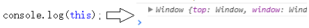
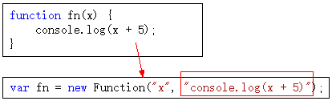

# 深入理解JavaScript原型和闭包 --简书【执行上下文】

什么是“执行上下文” （也叫做执行上下文环境） 暂且不下定义，先看一段代码

```javascript
console.log(a);//=>Uncaught ReferencecError：  a is not defined
console.log(a);
var a; //undefined
console.log(a);
var a=10; //=>undefined
```

第一句报错，a未定义，很正常

第二句，第三局都是输出undefined，说明浏览器在执行console.log(a)时，已经知道了a是undefined，但却不知道a=10

在一段js代码拿过来真正一句一句运行之前，浏览器已经做了一些"准备工作" 其中就包括对变量的生命，而不是赋值，变量赋值在执行语句的时候进行，


这是第一种情况

下面还有。来个简单的



有js开发经验的朋友都知道，无论在哪个位置获取this，都是有值的，至于this取之情况，比较复杂

与第一种情况不同的是，第一种情况只是对变量声明（并没有赋值），而此种情况直接给this赋值。这也是“准备工作”情况要做出的事情之一

在第三种情况中，需要注意代码注释中的两个名词--“函数表达式”和“函数声明”虽然两折都很常用，但是两者在准备工作时，确实两种待遇

```JavaScript
console.log(f1);//function f1（）{}
function f1(){}//声明函数
console.log(f2);//undefined
var f2=function(){};//函数表达式
```
看以上代码，“函数声明”时我们看到第二种情况的影子，而“函数表达式”时我们看到了第一种情况的影子

没错在准备工作中，对待函数表达式就像对待 `var a=10`这样的变量一样，只是声明，而对待函数声明时，却把函数整个赋值了

总结一下，“准备工作”完成了哪些工作

> - 变量、函数表达式声明——变量申明，默认赋值为undefined；

> - this-赋值；

> - 函数声明 ——赋值

以上三种情况我们称之为“执行上下文”或者“执行上下文环境”

这里解释一下为什么代码段分为这三种。

所谓“代码段”就是一段文本形式的代码。

首先，全局代码是一种，这个应该没有非议，本来就是手写文本到 `<script>` 标签里面的。

```JavaScript
<script type="text/javascript">

//代码段
</script>
```

其次，eval代码接收的也是一段文本形式的代码。

```js
eval("alert(123");
```

最后，函数体是代码段是因为函数在创建时，本质上是 new Function(…) 得来的，其中需要传入一个文本形式的参数作为函数体。

 

这样解释应该能理解了。