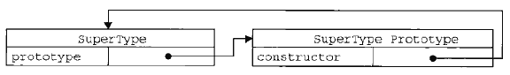
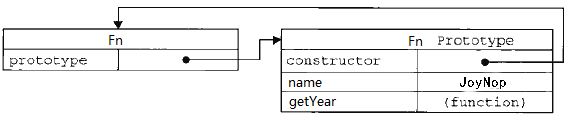

人家默认给的函数一个属性————prototype

对，每个函数都有一个属性家偶偶prototype

这个prototype的属性值是一个对象(**属性的集合** 再次强调)默认的只有一个叫做constructor的属性，指向函数本身



SuperType是是一个函数，右侧的方框就是它的原型。

原型既然是最为对象，属性的集合，不可能就只弄个constructor来玩玩，肯定可以自定义的增加许多属性。

例如Object这位大哥，人家的prototype里面就有好几个其他属性


有些方法似曾相识？

对，别着急，之后会让你知道他们为何似曾相识

接着往下说，你也可以自己定义方法的prototype属性

```JavaScript
function Fn(){};
Fn.prototype.name='JoyNope';
Fn.prototype.getYear=function(){
    return 1997
}
```

然后就变成这样



但是这样做有何用呢？ 解决这个问题，先说说jQuery

```JavaScript
var $div=$('div');
$div.attr('myName','JoyNop');
```

以上代码中`$('div')`返回的是一个对象，对象一一被函数构建出来。假设创建这一对象的函数是myjQuery。她是这样实现的

```JavaScript
myjQuery.prototype.attr=function(){
    //……
};
$('div')=new myjQuery();
```
如果用自己的代码来演示，就是这样

```javascript
function Fn(){
};
Fn.prototype.name='JoyNop';
Fn.prototype.getYear=function(){
    return 1997;
};
var fn=new Fn();
console.log(fn.name);
console.log(fn.getYear());
//不带括号打印文本
```
即 Fn是一个函数，fn对象是从Fn函数new出来的这样fn对象就可以调用Fn.prototype中的属性

因为每个对象都有一个隐藏的属性——`__proto__`

这个属性引用了创建这个对象的函数的prototype

即`fn.__proto__===Fn.prototype`

这里的`__proto__`称谓"隐形原型"
