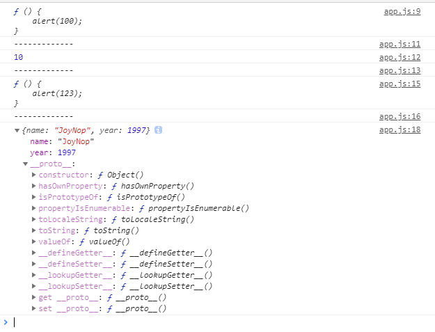

**“一切都是对象“这句话重点在于去如何理解"对象"这个额概**

当然，也不是所有的都是对象，值类型就不是对象

首先还是看看JavaScript中常用的运算符typeof

typeof 函数输出一共有几种类型，在此列出


```javascript
function show(x){
    console.log(typeof x);//undefined
    console.log(typeof 10);//number
    console.log(typeof 'abc'); // string
    console.log(typeof true);  // boolean
    console.log(typeof function () {}//function
    console.log(typeof [1, 'a', true]);//object
    console.log(typeof { a: 10, b: 20 });  //object
    console.log(typeof null);  //object
    console.log(typeof new Number(10));  //object
}
```

以上代码列出了typeof输出的集中类型标识，其中上面四中（undefined,number,string，Boolean）都属于`值类型` 不是对象，剩下的几种情况--函数、数组、对象、null、new Number(10)都是对象，他们都是`引用类型`

判断一个变量是不是非常简单，值类型的类型判断用typeof，引用类型的类型判断用instanceof

```JavaScript
var fn= function(){

};
console.log(fn instanceof Object);//true
```

**对象-若干属性的集合**

java或者c#中的对象都是new出来一个新的class，而且里面有字段属性，方法，规定非常严格，但是JavaScript就比较随意，数组都是对象，函数也是对象，对象里面的一切都是属性，只有属性，没有方法

那么这样的方法如何表示呢？

方法也是一种属性，因为他的属性表示为`键值对`的形式

*JavaScript的对象可以任意的扩展属性，没有class约束*

ex:

```JavaScript
var obj={
    a:10,
    b:function(x){
        alert(this.a+x);
    },
    c:{name:'JoyNop',year:1997}
};
```
> 以上代码中，obj是一个自定义的对象，其中a,b,c就是他的属性，而且在C属性值还是一个对象，他又有name/year两个属性

这个可能比较好理解，name函数和数组也可以这样定义吗？——当然不行，但是他可以用另一种形式，总之函数/数组之流，他就是属性的集合

以函数为例子

```JavaScript
var fn=function(){
    alert(100);
};
fn.a=10;
fn.b=function(){
    alert(123);
};
fn.c={name:JoyNop,year:1997};
```

输出



上段代码中，函数就作为对象赋给了a,b,c三个属性——很明显，这就是属性的集合吗？

这个有用吗？

回答：可以看看JQuery源码

在jQuery中`Jquery`或者`$s`这个变量其实是一个函数

```JavaScript
console.log(typeof $);  // function
console.log($.trim(" ABC "));
```

JavaScript与c#相比，首先需要解释的就是弱类型，因为弱类型是最基本的用法，而且非常常用

其次要解释的就是文本内容

> 一切（*引用类型*)都是对象，对象是**属性的集合**

最后，有个疑问。

在typeof的输出类型中，function和object都是对象，为何却要输出两种答案呢？都叫做object不行吗？——当然不行。