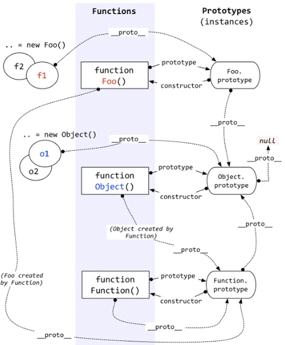

对于值类型，你可以通过typeof判断，string/number/boolean都很清楚，但是在typeof在判断引用类型的时候，返回值只有object/function你不知道他到底是一个object还是一个数组，还是new Number

这是就需要用到instancceof

ex

```JavaScript
function Foo(){}
var f1=new Foo();

console.log(f1 instanceof Foo);//true
console.log(f1 instanceof Onject);//true
```
在途中，f1这个对象被Foo创建，但是`f1 instanceof Object`为什么是true呢

至于为什么过会再说，先把instanceof判断的规则告诉大家，根据以上代码看下图


Instanceof运算符的第一个变量是对象，暂时称谓A;

第二个变量一般是一个函数，暂时称谓B

Instanceof的判断规则是：*沿着A的__proto__这条线来找，同时沿着B的prototype这条线来找，如果两条线能找到同一个引用，既同一个对象，那么就返回true，如果找到重点还未重合，则返回false*

按照以上规则，大家看看“ f1 instanceof Object ”这句代码是不是true？ 根据上图很容易就能看出来，就是true。

通过以上规则，你可以解释很多怪异的现象 ，例如

```JavaScript
console.log(Object insstanceof Function);//true
console.log(Function insstanceof Object);//true
console.log(Function insstanceof Function);//true
```

看似很乱的东西，答案却是true，是为何

上一节咱们贴了好多的图片，其实那些图片是可以联合成一个整体的，即：



这个图千万不要嫌烦，必须一条线一条线爱着分析

问题又出来了。Instanceof这样设计，到底有什么用？到底instanceof想表达什么呢？

重点就这样被这位老朋友给引出来了——**继承** ——**原型链**。

即，instanceof表示的就是一种继承关系，或者原型链的结构。请看下节分解。