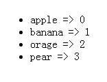

# “Vue2.0”跟俺一起全面入坑 02

## 1. 列表渲染-v-for=""

**功能：** 根据一组数据的选项列表进行渲染（自动for循环）
**语法：** value,key in items/value,key for items

**变异方法：vue提供一组方法，对数组进行操作的时候，会触发视图更新(map()不会触发)，但其并不是原生的方法，原生的方法是不会触发视图更新

|        |       |         |           |          |        |           |
| ------ | ----- | ------- | --------- | -------- | ------ | --------- |
| push() | pop() | shift() | unshift() | splice() | sort() | reserve() |

eg:定义一个水果数组数据

```html
<body>
    <div id="app">
        <ul>
            <li v-for="(val,key) in fruitsArr">{{val}}=>{{key}}</li>
            <!-- //循环出来的列表项 -->
        </ul>
    <div>
</body>
<script src="../vue.js"></script>
<script type="text/javascript">
    document.addEventListener('DOMContentLoaded',function () {
        var vm = new Vue({
            el: '#app',
            data:{fruitsArr:['apple','banana','orange','pear']} //数据源
        });
    },false);
 </script>
```

在页面展示如下：
 


## 2. 事件处理器（指令，绑定事件） — v-on=""

**功能：** 用来监听DOM事件触发代码。

**语法：** v-on:eventName="eventHandle"

**指令简写：** @eventName="eventHandle"

**事件处理函数：卸载Vue实例的 `methods` 中进行统一管理。**

事件对象是时间系统提供的，在事件处理函数中获取

** a)当行间不触发的时**

