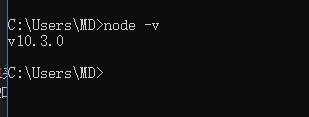
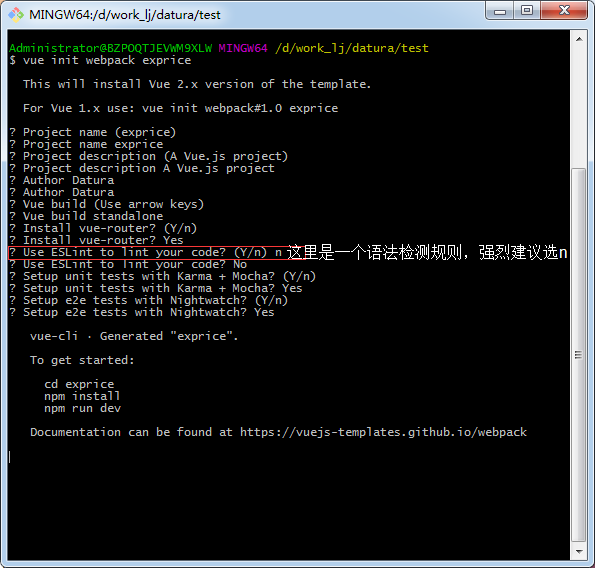
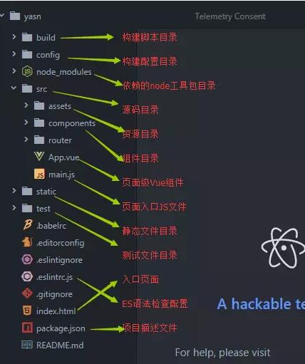

# Vue2.0史上最全入坑教程（上）—— 搭建Vue脚手架（vue-cli）

Vue作为前端三大框架之一足以说明其以悄然成为主流。16年10月Vue发布了2.x版本，经过了一段时间的摸索和看官方的教程和api，才了解到2.0版本在1.0版本的基础上做了好多调整，废弃了好多api。。。废话不多说了，把我踩过的坑，在这里跟大家说说，希望对初学者有所帮助。ps：高手请绕道。

>说明：此文章参考了网上一些前人的技术分享，自己拿过来总结一下。此文章是基于webpack构建的vue项目，并实现简单的单页面应用。其中利用到的相关技术会简单加以说明

## 一、那么我们就从最简单的环境搭建开始：

安装node.js，从node.js官网下载并安装node，安装过程很简单，一路“下一步”就可以了（傻瓜式安装）。安装完成之后，打开命令行工具(win+r，然后输入cmd)，输入 `node -v`，如下图，如果出现相应的版本号，则说明安装成功。



这里需要说明下，因为在官网下载安装node.js后，就已经自带npm（包管理工具）了，另需要注意的是npm的版本最好是3.x.x以上，以免对后续产生影响。

安装淘宝镜像，打开命令行工具，把这个（npm install -g cnpm --registry= https://registry.npm.taobao.org）复制（这里要手动复制就是用鼠标右键那个，具体为啥不多解释），安装这里是因为我们用的npm的服务器是外国，有的时候我们安装“依赖”的时候很很慢很慢超级慢，所以就用这个cnpm来安装我们说需要的“依赖”。安装完成之后输入 cnpm -v，如下图，如果出现相应的版本号，则说明安装成功。

安装webpack，打开命令行工具输入：`npm install webpack -g`，安装完成之后输入 `webpack -v`，如下图，如果出现相应的版本号，则说明安装成功。

安装vue-cli脚手架构建工具，打开命令行工具输入：`npm install vue-cli -g`，安装完成之后输入 `vue -V`（注意这里是大写的“V”），如下图，如果出现相应的版本号，则说明安装成功。


## 二、通过以上四步，我们需要准备的环境和工具都准备好了，接下来就开始使用vue-cli来构建项目

1. 在硬盘上找一个文件夹放工程用的。这里有两种方式指定到相关目录：①cd 目录路径 ②如果以安装git的，在相关目录右键选择Git Bash Here

2. 安装vue脚手架输入：vue init webpack exprice ，注意这里的“exprice” 是项目的名称可以说是随便的起名，但是需要主要的是“不能用中文”。

```
$ vue init webpack exprice --------------------- 这个是那个安装vue脚手架的命令
This will install Vue 2.x version of the template. ---------------------这里说明将要创建一个vue 2.x版本的项目
For Vue 1.x use: vue init webpack#1.0 exprice
? Project name (exprice) ---------------------项目名称
? Project name exprice
? Project description (A Vue.js project) ---------------------项目描述
? Project description A Vue.js project
? Author Datura --------------------- 项目创建者
? Author Datura
? Vue build (Use arrow keys)
? Vue build standalone
? Install vue-router? (Y/n) --------------------- 是否安装Vue路由，也就是以后是spa（但页面应用需要的模块）
? Install vue-router? Yes
? Use ESLint to lint your code? (Y/n) n ---------------------是否启用eslint检测规则，这里个人建议选no
? Use ESLint to lint your code? No
? Setup unit tests with Karma + Mocha? (Y/n)
? Setup unit tests with Karma + Mocha? Yes
? Setup e2e tests with Nightwatch? (Y/n)
? Setup e2e tests with Nightwatch? Yes
vue-cli · Generated "exprice".
To get started: --------------------- 这里说明如何启动这个服务
cd exprice
npm install
npm run dev

```
如下图：



3. cd 命令进入创建的工程目录，首先cd exprice（这里是自己建工程的名字）

4. 安装项目依赖：`npm install`，因为自动构建过程中已存在package.json文件，所以这里直接安装依赖就行。不要从国内镜像cnpm安装(会导致后面缺了很多依赖库)，但是但是如果真的安装“个把”小时也没成功那就用：`cnpm install` 吧
安装 vue 路由模块 vue-router 和网络请求模块 vue-resource，输入：`cnpm install vue-router vue-resource --save`。

**创建完成的“exprice”目录如下：**

下面我简单的说明下各个目录都是干嘛的：



启动项目，输入：npm run dev。服务启动成功后浏览器会默认打开一个“欢迎页面” 


注意：这里是默认服务启动的是本地的8080端口，所以请确保你的8080端口不被别的程序所占用。
至此简单的一个项目构建完毕....后面我将继续利用这个构建的项目写一个简单的单页面应用。

