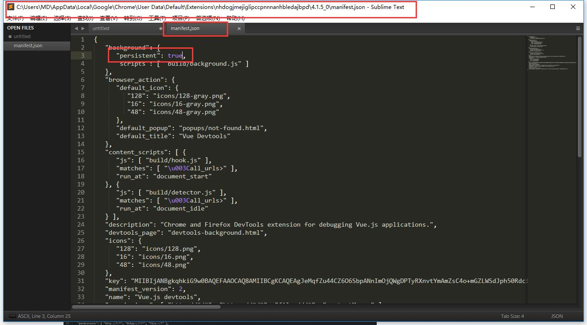
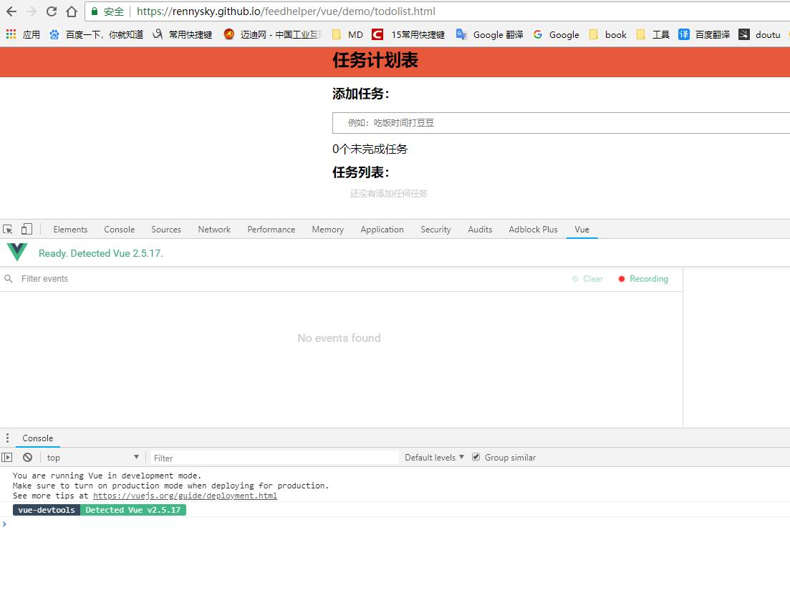

# VueJs调试工具——vue-devtools

[Vue-devtools下载地址](https://github.com/vuejs/vue-devtools)

## 第一步

将下载好的文件拖到chrome拓展栏中（更多工具=>拓展程序）

## 第二步

**修改配置文件：**

win10目录：`C:\Users\MD\AppData\Local\Google\Chrome\User Data\Default\Extensions\nhdogjmejiglipccpnnnanhbledajbpd\4.1.5_0`

打开文件“manifest.json ”修改参数（将false改成true），如下图：

## 第三步

打开vue项目（npm run dev），按F12点击vue选项。如下图：

