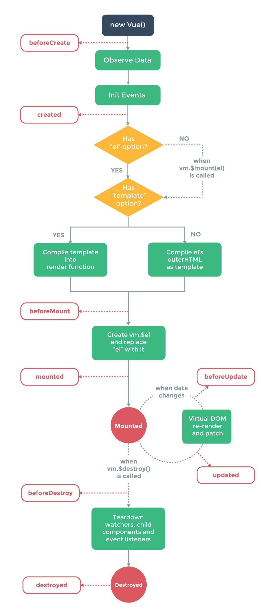

# Vue2.0 探索之路——生命周期和钩子函数的一些理解

## vue生命周期简介




从上图可以很明显的看出现在`vue2.0`都包括了哪些生命周期的函数了。

## 生命周期探究

对于执行顺序和什么事执行，基本上看着两个图有个了解，结合代码看狗子函数的执行。

>下面代码可以直接复制出去执行

[/demo/ifecycle1.html](http://rennysky.github.io/FEHelper/vue/demo/lifecycle1.html)

```html
<!DOCTYPE html>
<html>
<head>
    <title></title>
    <script type="text/javascript" src="https://cdn.jsdelivr.net/vue/2.1.3/vue.js"></script>
</head>
<body>

<div id="app">
     <p>{{ message }}</p>
</div>

<script type="text/javascript">
    
  var app = new Vue({
      el: '#app',
      data: {
          message : "xuxiao is boy" 
      },
       beforeCreate: function () {
                console.group('beforeCreate 创建前状态===============》');
               console.log("%c%s", "color:red" , "el     : " + this.$el); //undefined
               console.log("%c%s", "color:red","data   : " + this.$data); //undefined 
               console.log("%c%s", "color:red","message: " + this.message)  
        },
        created: function () {
            console.group('created 创建完毕状态===============》');
            console.log("%c%s", "color:red","el     : " + this.$el); //undefined
               console.log("%c%s", "color:red","data   : " + this.$data); //已被初始化 
               console.log("%c%s", "color:red","message: " + this.message); //已被初始化
        },
        beforeMount: function () {
            console.group('beforeMount 挂载前状态===============》');
            console.log("%c%s", "color:red","el     : " + (this.$el)); //已被初始化
            console.log(this.$el);
               console.log("%c%s", "color:red","data   : " + this.$data); //已被初始化  
               console.log("%c%s", "color:red","message: " + this.message); //已被初始化  
        },
        mounted: function () {
            console.group('mounted 挂载结束状态===============》');
            console.log("%c%s", "color:red","el     : " + this.$el); //已被初始化
            console.log(this.$el);    
               console.log("%c%s", "color:red","data   : " + this.$data); //已被初始化
               console.log("%c%s", "color:red","message: " + this.message); //已被初始化 
        },
        beforeUpdate: function () {
            console.group('beforeUpdate 更新前状态===============》');
            console.log("%c%s", "color:red","el     : " + this.$el);
            console.log(this.$el);   
               console.log("%c%s", "color:red","data   : " + this.$data); 
               console.log("%c%s", "color:red","message: " + this.message); 
        },
        updated: function () {
            console.group('updated 更新完成状态===============》');
            console.log("%c%s", "color:red","el     : " + this.$el);
            console.log(this.$el); 
               console.log("%c%s", "color:red","data   : " + this.$data); 
               console.log("%c%s", "color:red","message: " + this.message); 
        },
        beforeDestroy: function () {
            console.group('beforeDestroy 销毁前状态===============》');
            console.log("%c%s", "color:red","el     : " + this.$el);
            console.log(this.$el);    
               console.log("%c%s", "color:red","data   : " + this.$data); 
               console.log("%c%s", "color:red","message: " + this.message); 
        },
        destroyed: function () {
            console.group('destroyed 销毁完成状态===============》');
            console.log("%c%s", "color:red","el     : " + this.$el);
            console.log(this.$el);  
               console.log("%c%s", "color:red","data   : " + this.$data); 
               console.log("%c%s", "color:red","message: " + this.message)
        }
    })
</script>
</body>
</html>
```

## create 和 mounted 相关

咱们在chrome浏览器里打开，f12看console就能发现

>`beforecreated` el和data并未初始化

>`created` 完成了data数据的初始化，el没有

>`beforeMount` 完成了el和data的初始化

>`mounted` 完成挂载

另外在红标处，我们还发现el还是{{message}}，这里就是应用的`Virtual DOM` 虚拟DOM技术，先把坑占住了，到后面`mounted`挂在的时候，再把值渲染进去。


## update 相关

这里我们在 chrome console里执行以下命令

```
app.message='yes !! i do';
```
下面就能看到data里的值被修改后，将会触发update的操作。


## destroy 相关

关于销毁，暂时不是很清楚，我们在console里面执行下命令对，vue实例进行销毁。销毁完成后，我们再重新对message的值做改变，vue不再对此进行响应了。但是原先生成的dom元素还存在，可以这么理解，执行了destroy操作，后续就不再受vue控制了。

>app.$destroy();


## 生命周期总结

这么多狗子函数，我们怎么用呢，我想大家还有这样的疑问吧，我也有哈哈哈哈哈哈

>`beforecreate`:举个栗子：这个可以加载loading事件

>`created`:在这结束loading，还可以做一些初始化，实现函数自执行

>`mounted`：在这发起后端请求，那会数据，配合路由狗子做一些事情

>`beforeDestroy`：你确认删除XXX吗？destroyed：当前组件已删除，清空相关内容

## 参考文献

https://segmentfault.com/q/1010000007704114?_ea=1431323

http://www.cnblogs.com/gagag/p/6246493.html